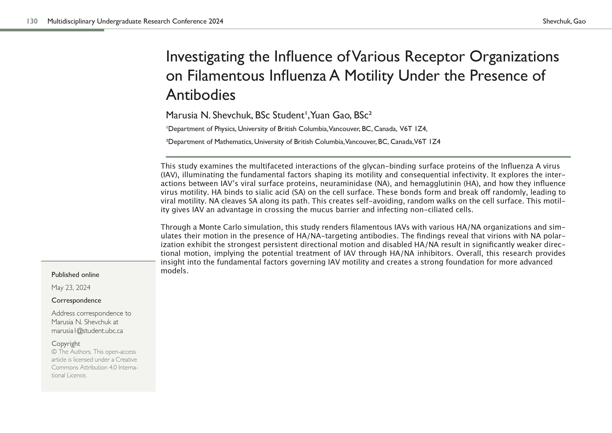

# REX_IAV_Diffusion_Simulation

This is the repository for the University of British Columbia Undergraduate Research Experience Program Math Bio Group 2023-11 to 2024-03, consisting of [Yuan Gao](https://ivanygao.github.io/) and Marusia Shevchuk under the supervision of [Liam Yih](https://www.linkedin.com/in/liam-yih/). The code is developed in Julia, and the mathematical parameters are derived from Vahey and Fletcher's paper [1].

## Research question:

Investigating the Influence of Various Receptor Organizations on Filamentous Influenza A Motility Under the Presence of Antibodies

## Abstract

## Poster

## Bibliography:

[1] M. D. Vahey and D. A. Fletcher, “Influenza A virus surface proteins are organized to help penetrate host mucus,” eLife, vol. 8, p. e43764, May 2019, doi: 10.7554/eLife.43764.
